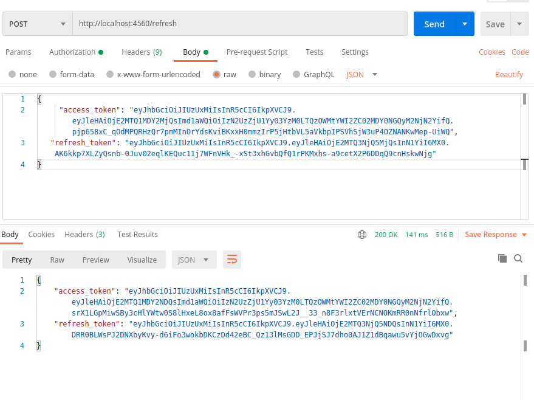

# jwt-auth

Do not forget to export secret key beforehand.

Linux:
```bash
  export SECRET_KEY=<your_secret_key>
```
Windows:
```batch
  SET SECRET_KEY=<your_secret_key>
```

There's 2 endpoints in total, namely /signin (to get a pair of access and refresh tokens), and /refresh (to refresh access token)

Server runs on localhost with port 4560

## Some notes about running

When running an application, ensure that mongodb server is running as well, it might result in stall of the whole application otherwise.

After rerunning the server, user's credentials such as refresh token, token's expiration time, and also checksum get cleared, so
be sure to hit signin endpoint once again.

## Examples of requests

Sign in request


Token refresh request


